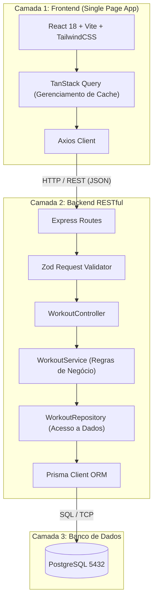
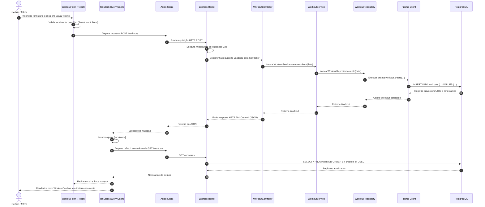

# Arquitetura e Fluxo de Dados - battleRank

## 1. Visão Geral da Arquitetura em 3 Camadas

```mermaid
flowchart TD
    subgraph Frontend["Camada 1: Frontend (Single Page App)"]
        UI["React 18 + Vite + TailwindCSS"]
        State["TanStack Query (Gerenciamento de Cache)"]
        HTTP["Axios Client"]
    end

    subgraph Backend["Camada 2: Backend RESTful"]
        Route["Express Routes"]
        Validation["Zod Request Validator"]
        Controller["WorkoutController"]
        Service["WorkoutService (Regras de Negócio)"]
        Repository["WorkoutRepository (Acesso a Dados)"]
        PrismaClient["Prisma Client ORM"]
    end

    subgraph Database["Camada 3: Banco de Dados"]
        Postgres[("PostgreSQL 5432")]
    end

    UI --> State
    State --> HTTP
    HTTP -->|"HTTP / REST (JSON)"| Route
    Route --> Validation
    Validation --> Controller
    Controller --> Service
    Service --> Repository
    Repository --> PrismaClient
    PrismaClient -->|"SQL / TCP"| Postgres
```

---

## 2. Fluxo Obrigatório de Criação de Treino (AC1)

```mermaid
sequenceDiagram
    autonumber
    actor Atleta as Usuário / Atleta
    participant Form as WorkoutForm (React)
    participant RQ as TanStack Query Cache
    participant Axios as Axios Client
    participant API as Express Route
    participant Ctrl as WorkoutController
    participant Svc as WorkoutService
    participant Rep as WorkoutRepository
    participant Prisma as Prisma Client
    participant DB as PostgreSQL

    Atleta->>Form: Preenche formulário e clica em Salvar Treino
    Form->>Form: Valida localmente com Zod (React Hook Form)
    Form->>Axios: Dispara mutation POST /workouts
    Axios->>API: Envia requisição HTTP POST
    API->>API: Executa middleware de validação Zod
    API->>Ctrl: Encaminha requisição validada para Controller
    Ctrl->>Svc: Invoca WorkoutService.createWorkout(data)
    Svc->>Rep: Invoca WorkoutRepository.create(data)
    Rep->>Prisma: Executa prisma.workout.create(...)
    Prisma->>DB: INSERT INTO workouts (...) VALUES (...)
    DB-->>Prisma: Registro salvo com UUID e timestamps
    Prisma-->>Rep: Objeto Workout persistido
    Rep-->>Svc: Retorna Workout
    Svc-->>Ctrl: Retorna Workout
    Ctrl-->>API: Envia resposta HTTP 201 Created (JSON)
    API-->>Axios: Retorno do JSON
    Axios-->>RQ: Sucesso na mutação
    RQ->>RQ: Invalida query ['workouts']
    RQ->>Axios: Dispara refetch automático de GET /workouts
    Axios->>API: GET /workouts
    API->>DB: SELECT * FROM workouts ORDER BY created_at DESC
    DB-->>API: Registros atualizados
    API-->>RQ: Novo array de treinos
    RQ-->>Form: Fecha modal e limpa campos
    RQ-->>Atleta: Renderiza novo WorkoutCard na tela instantaneamente
```
